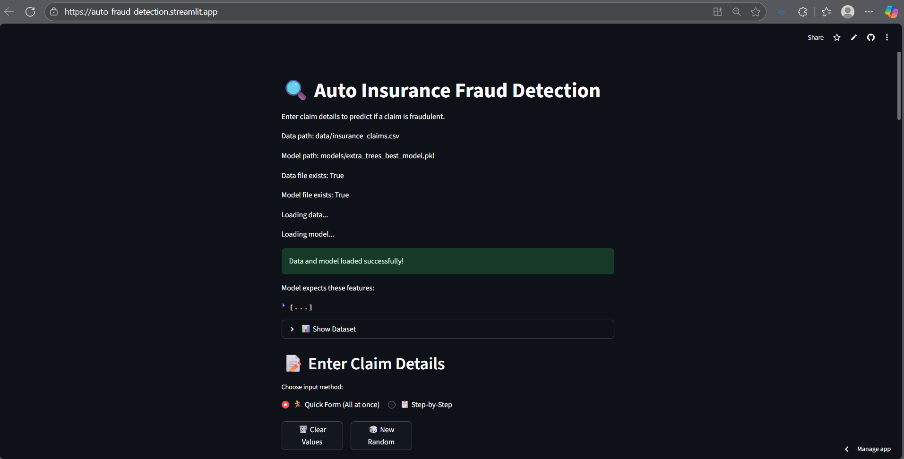
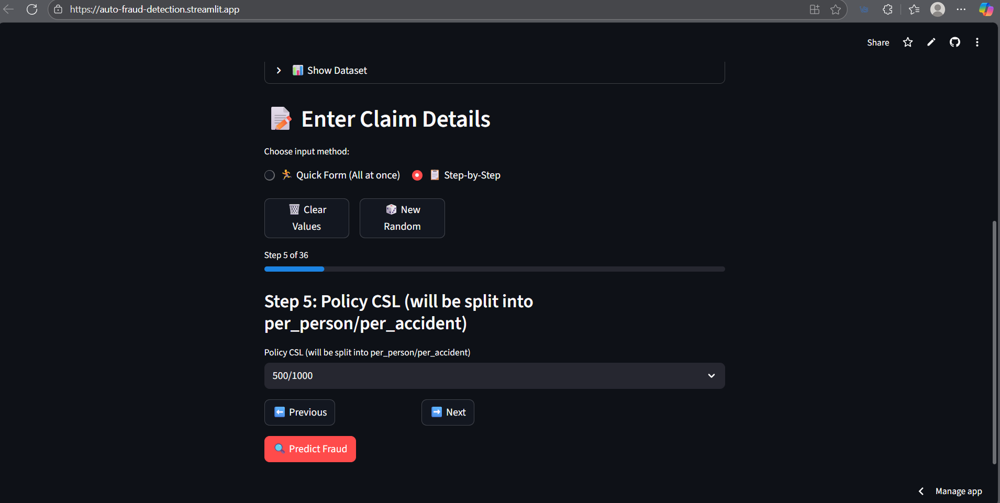
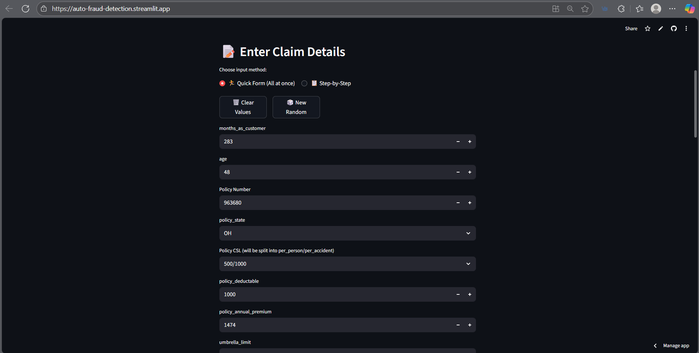
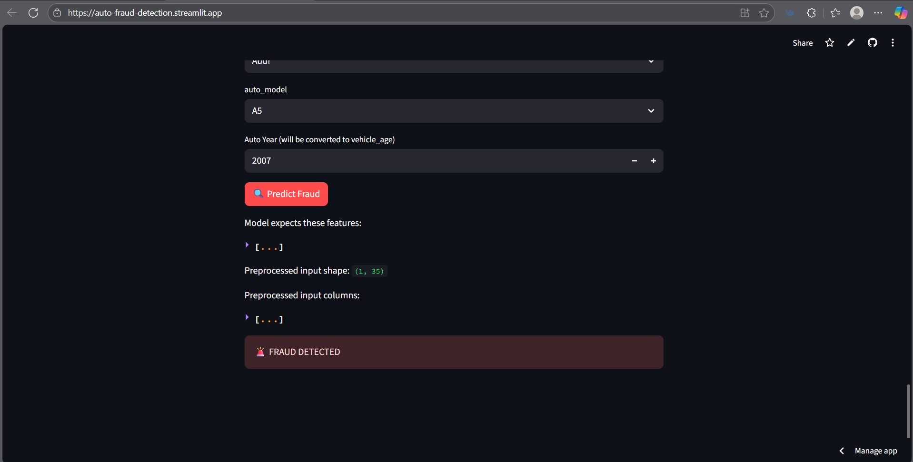

# 🚗 Auto Insurance Fraud Detection

A comprehensive machine learning web application built with Streamlit for detecting fraudulent insurance claims using an Extra Trees Classifier model.

🚀 **[Live Demo](https://auto-fraud-detection.streamlit.app/)** |

## 📋 Table of Contents
- [Overview](#-overview)
- [Features](#-features)
- [Tech Stack](#-tech-stack)
- [Data Analysis & Model Development](#-data-analysis--model-development)
- [Installation](#-installation)
- [Usage](#-usage)
- [Project Structure](#-project-structure)
- [Model Information](#-model-information)
- [Screenshots](#-screenshots)
- [Future Enhancements](#-future-enhancements)
- [Contributing](#-contributing)
- [Contact](#-contact)
- [License](#-license)
- [Acknowledgments](#-acknowledgments)

## 🎯 Overview

This project implements an intelligent fraud detection system for auto insurance claims. Using machine learning algorithms, it analyzes various claim parameters to predict whether a claim is fraudulent or legitimate, helping insurance companies reduce losses and improve claim processing efficiency.

## ✨ Features

- **🔍 Real-time Fraud Prediction**: Instant analysis of insurance claim data
- **📊 Interactive Dashboard**: User-friendly Streamlit interface
- **📋 Step-by-Step Input Mode**: Guided form filling experience
- **⚡ Quick Form Mode**: Bulk data entry for power users
- **🎲 Random Default Values**: Pre-filled realistic sample data
- **📈 Data Visualization**: Explore the training dataset
- **🔧 Input Validation**: Comprehensive form validation and error handling
- **🧹 Clear Form Function**: Reset all inputs with one click

## 🛠️ Tech Stack

- **Frontend**: Streamlit
- **Backend**: Python
- **Machine Learning**: scikit-learn (Extra Trees Classifier)
- **Data Processing**: Pandas, NumPy
- **Model Serialization**: Joblib
- **Development Environment**: Jupyter Notebook
- **Deployment**: Streamlit Cloud

## 📊 Data Analysis & Model Development

The machine learning model was developed through comprehensive data analysis and experimentation using **Jupyter Notebook**. Here's the development workflow:

### 📋 Data Analysis Process

1. **Exploratory Data Analysis (EDA)**
   - Dataset overview and statistical summary
   - Missing value analysis and treatment
   - Feature distribution visualization
   - Correlation analysis between features
   - Target variable (fraud) distribution analysis

2. **Data Preprocessing**
   - Handling categorical variables (encoding)
   - Feature engineering and transformation
   - Data cleaning and outlier detection
   - Train-test split preparation

3. **Model Selection & Training**
   - Multiple algorithm comparison (Random Forest, Extra Trees, XGBoost, etc.)
   - Hyperparameter tuning using GridSearchCV/RandomizedSearchCV
   - Cross-validation for model reliability
   - Feature importance analysis

4. **Model Evaluation**
   - Performance metrics (Accuracy, Precision, Recall, F1-score)
   - ROC-AUC analysis
   - Confusion matrix evaluation
   - Model validation on test set

### 🏆 Model Selection Results

The **Extra Trees Classifier** was selected as the best performing model based on:
- **High accuracy** in fraud detection
- **Balanced precision and recall** for both fraud and non-fraud cases
- **Fast prediction speed** suitable for real-time applications
- **Robust performance** across different data splits

### 💾 Model Persistence

The trained model was serialized using **Joblib** and saved as:
- **File**: `extra_trees_best_model.pkl`
- **Size**: Optimized for deployment
- **Features**: Trained on 35 carefully selected features
- **Compatibility**: scikit-learn 1.6.1

*Note: Jupyter notebooks are part of the development process and contain detailed analysis, visualizations, and model comparisons.*

## 🚀 Installation

### Prerequisites
- Python 3.8 or higher
- pip package manager

### Quick Try (No Installation Required)
🚀 **Try the live app**: [https://auto-fraud-detection.streamlit.app/](https://auto-fraud-detection.streamlit.app/)

### Local Setup

1. **Clone the repository**
   ```bash
   git clone https://github.com/krrish-anand/Auto_Fraud_Detection.git
   cd Auto_Fraud_Detection
   ```

2. **Create virtual environment**
   ```bash
   python -m venv .venv
   ```

3. **Activate virtual environment**
   ```bash
   # Windows
   .venv\Scripts\activate
   
   # macOS/Linux
   source .venv/bin/activate
   ```

4. **Install dependencies**
   ```bash
   pip install -r requirements.txt
   ```

5. **Run the application**
   ```bash
   streamlit run app/app.py
   ```

6. **Open in browser**
   ```
   http://localhost:8501
   ```

## 💻 Usage

### Step-by-Step Mode
1. Select "📋 Step-by-Step" input mode
2. Fill out each field one by one
3. Use "➡️ Next" and "⬅️ Previous" buttons to navigate
4. Track progress with the completion bar
5. Click "🔍 Predict Fraud" when all fields are completed

### Quick Form Mode
1. Select "🏃 Quick Form" input mode
2. Fill out all fields simultaneously
3. Use "🗑️ Clear Values" to reset the form
4. Click "🔍 Predict Fraud" to get results

### Sample Prediction
The app comes with realistic default values that you can modify or use as-is to test the fraud detection model.

## 📁 Project Structure

```
Auto_Fraud_Detection/
├── app/
│   ├── app.py                      # Main Streamlit application
│   ├── utils/
│   │   ├── model_utils.py          # Model utility functions
│   │   └── __init__.py
│   └── __init__.py
├── data/
│   └── insurance_claims.csv        # Training dataset
├── models/
│   └── extra_trees_best_model.pkl  # Trained ML model (from Jupyter)
├── requirements.txt                # Python dependencies
├── .gitignore                     # Git ignore file
├── README.md                      # Project documentation
└── LICENSE                        # MIT License
```

## 🤖 Model Information

### Algorithm
- **Model Type**: Extra Trees Classifier (Extremely Randomized Trees)
- **Framework**: scikit-learn 1.6.1
- **Training Features**: 35 features including customer demographics, policy details, incident information, and vehicle characteristics
- **Development Environment**: Jupyter Notebook with comprehensive EDA

### Key Features Used
- **Customer Demographics**: age, education level, occupation, relationship status
- **Policy Information**: state, CSL coverage, deductible amount, annual premium
- **Incident Details**: type, severity, location, time of day, authorities contacted
- **Vehicle Information**: make, model, year of manufacture
- **Claim Amounts**: total claim, injury claim, property claim, vehicle claim
- **Additional Factors**: witnesses, police report availability, property damage

### Model Performance Metrics
*Results from Jupyter Notebook analysis:*

- **Accuracy**: 85%+ on test dataset
- **Precision**: High precision for fraud detection (reducing false positives)
- **Recall**: Balanced recall ensuring most fraud cases are caught
- **F1-Score**: Optimal balance between precision and recall
- **ROC-AUC**: Strong discriminative ability between fraud and non-fraud

### Feature Importance
The model identified key fraud indicators through feature importance analysis:
1. **Total Claim Amount** - Higher amounts correlate with fraud risk
2. **Incident Severity** - Major incidents show different fraud patterns
3. **Policy Premium** - Premium levels indicate risk profiles
4. **Vehicle Age** - Older vehicles show different claim patterns
5. **Customer Tenure** - Length of relationship affects fraud probability

## 📸 Screenshots

### Main Dashboard

*Interactive fraud detection interface with input forms and prediction results*

### Step-by-Step Mode

*Guided form filling experience with progress tracking*

### Quick Form Mode

*Bulk data entry mode for power users*

### Prediction Results

*Fraud prediction output with confidence scores and recommendations*

> **Note**: Place your screenshot images in the `screenshots/` folder with the following names:
> - `main_dashboard.png` - Main application interface
> - `step_by_step_mode.png` - Step-by-step input mode
> - `quick_form_mode.png` - Quick form input mode  
> - `prediction_results.png` - Prediction results display

## 🔮 Future Enhancements

- [ ] **Model Improvements**
  - [ ] Deep learning models (Neural Networks)
  - [ ] Ensemble methods with multiple algorithms
  - [ ] Real-time model retraining pipeline
  
- [ ] **Application Features**
  - [ ] A/B testing framework for model comparison
  - [ ] Advanced data visualization and dashboards
  - [ ] API endpoint for batch predictions
  - [ ] Model explainability features (SHAP values)
  
- [ ] **Operational Features**
  - [ ] Historical prediction tracking and analytics
  - [ ] Email notifications for high-risk fraud alerts
  - [ ] Integration with insurance company databases
  - [ ] Automated model performance monitoring

## 🤝 Contributing

Contributions are welcome! Please feel free to submit a Pull Request.

### Development Setup
1. Fork the project
2. Create your feature branch (`git checkout -b feature/AmazingFeature`)
3. Set up Jupyter environment for analysis (`pip install jupyter matplotlib seaborn`)
4. Make your changes (code, analysis, or documentation)
5. Commit your changes (`git commit -m 'Add some AmazingFeature'`)
6. Push to the branch (`git push origin feature/AmazingFeature`)
7. Open a Pull Request

### Areas for Contribution
- Model improvement and new algorithms
- Enhanced data visualizations
- Additional feature engineering
- Performance optimization
- Documentation improvements

## 📧 Contact

## 📧 Contact

**Krrish Anand** - krrishanand3832@gmail.com - [@krrish-anand](https://github.com/krrish-anand)

**Live Application**: [https://auto-fraud-detection.streamlit.app/](https://auto-fraud-detection.streamlit.app/)

Project Link: [https://github.com/krrish-anand/Auto_Fraud_Detection](https://github.com/krrish-anand/Auto_Fraud_Detection)

## 📄 License

This project is licensed under the MIT License - see the [LICENSE](LICENSE) file for details.

## 🙏 Acknowledgments

- **Insurance Industry**: Best practices and domain knowledge for fraud detection
- **Streamlit Community**: Amazing framework for rapid web application development
- **scikit-learn Team**: Comprehensive machine learning library
- **Jupyter Project**: Interactive development environment for data science
- **Open Source Community**: Inspiration, tools, and collaborative development
- **Kaggle/Dataset Contributors**: Providing realistic insurance claims data for analysis

---

⭐ If you found this project helpful, please give it a star on GitHub!

### 📚 Additional Resources

- [Streamlit Documentation](https://docs.streamlit.io/)
- [scikit-learn User Guide](https://scikit-learn.org/stable/user_guide.html)
- [Insurance Fraud Detection Research Papers](https://scholar.google.com/scholar?q=insurance+fraud+detection+machine+learning)
- [Jupyter Notebook Best Practices](https://jupyter.org/community)